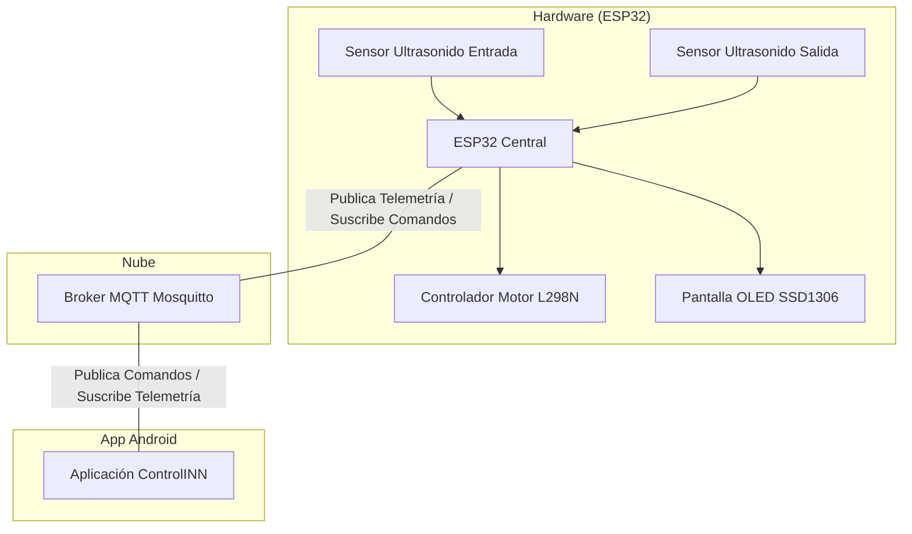

# Control de Faja Transportadora Automatizada

## Descripción del Proyecto
Este proyecto consiste en un sistema de control remoto y monitoreo para una faja transportadora automatizada. Utiliza un **ESP32** como unidad de control central que se comunica mediante el protocolo **MQTT** con una aplicación móvil **Android**. El sistema permite operar en dos modos:
- **Modo Automático:** La faja se enciende cuando el sensor de entrada detecta un objeto y se detiene cuando el sensor de salida lo detecta.
- **Modo Manual:** El usuario tiene control total sobre el encendido, apagado, dirección y velocidad del motor desde la aplicación móvil.

La aplicación móvil integra un contador de cajas inteligente que suma al detectar la entrada y resta al detectar la salida en tiempo real.

## Arquitectura del Sistema
El sistema sigue un modelo de comunicación Pub/Sub a través de un bróker MQTT:



## Diagrama de Conexión de Hardware
A continuación se detalla la conexión de los componentes al ESP32:

| Componente | Pin ESP32 | Función |
| :--- | :--- | :--- |
| **L298N** | GPIO 13 (PWM) | ENA (Velocidad) |
| **L298N** | GPIO 27 | IN1 (Dirección) |
| **L298N** | GPIO 4 | IN2 (Dirección) |
| **HC-SR04 1** | GPIO 5 | TRIG (Entrada) |
| **HC-SR04 1** | GPIO 18 | ECHO (Entrada) |
| **HC-SR04 2** | GPIO 2 | TRIG (Salida) |
| **HC-SR04 2** | GPIO 15 | ECHO (Salida) |
| **OLED** | GPIO 21 (SDA) | Datos I2C |
| **OLED** | GPIO 22 (SCL) | Reloj I2C |

## Configuración del Broker MQTT
El sistema utiliza un bróker Mosquitto alojado en un VPS con la siguiente configuración:

### Credenciales de Conexión
- **Servidor:** `38.250.116.214`
- **Puerto:** `1883`
- **Usuario:** `joseph`
- **Contraseña:** `1234`
- **Client ID (App):** `Android_Faja_Remote`
- **Client ID (ESP32):** `ESP32_Faja_Joseph`

### Tópicos (Topics)
| Tópico | Dirección | Función | Mensaje |
| :--- | :--- | :--- | :--- |
| `/faja/comando` | App -> ESP32 | Control de modo y motor | `A`, `M`, `ON`, `OFF`, `D` |
| `/faja/velocidad` | App -> ESP32 | Ajuste de velocidad | `0-255` (String) |
| `/faja/telemetria` | ESP32 -> App | Estado de sensores y motor | JSON: `{"s1":x, "s2":y, "vel":z}` |

## Requisitos de Hardware
1. **Microcontrolador:** ESP32 (NodeMCU o similar).
2. **Sensores:** 2x Sensores Ultrasonidos HC-SR04 (Entrada y Salida).
3. **Actuador:** Motor DC con faja transportadora.
4. **Controlador de Motor:** Puente H L298N.
5. **Pantalla:** Pantalla OLED SSD1306 (128x64).
6. **Fuente de alimentación:** 12V para el motor y 5V/USB para el ESP32.

## Instrucciones de Instalación

### 1. Carga del Código (Arduino IDE)
1. Instala las librerías necesarias: `PubSubClient`, `Adafruit GFX`, `Adafruit SSD1306`.
2. Abre el código proporcionado abajo.
3. Asegúrate de que las credenciales de red sean correctas.
4. Carga el código al dispositivo.

### 2. Aplicación Android
1. Abre el proyecto `ControlINN` en **Android Studio**.
2. Sincroniza el proyecto con Gradle.
3. Compila y ejecuta la aplicación en un dispositivo físico o emulador.

---

## Código del ESP32 (C++ Comentado)

```cpp
#include <WiFi.h>
#include <PubSubClient.h>
#include <Wire.h>
#include <Adafruit_GFX.h>
#include <Adafruit_SSD1306.h>

// Configuración de red WiFi
const char* WIFI_SSID = "Comunidad Innovadores";
const char* WIFI_PASSWORD = "INn0V4-2K23!*";

// Configuración del servidor MQTT (VPS Elastika)
const char* MQTT_SERVER = "38.250.116.214";
const int MQTT_PORT = 1883;
const char* MQTT_USER = "joseph";
const char* MQTT_PASS = "1234";

// Definición de pines para el motor y sensores
const int pinENA = 13;   // Pin PWM para control de velocidad
const int pinIN1 = 27;   // Pin de dirección 1
const int pinIN2 = 4;    // Pin de dirección 2
const int pinTRIG1 = 5;  // Trigger Sensor Ultrasonido 1 (Entrada)
const int pinECHO1 = 18; // Echo Sensor Ultrasonido 1 (Entrada)
const int pinTRIG2 = 2;  // Trigger Sensor Ultrasonido 2 (Salida)
const int pinECHO2 = 15; // Echo Sensor Ultrasonido 2 (Salida)

// Variables de estado del sistema
char estadoModo = 'A';      // 'A' para Automático, 'M' para Manual
bool motorEncendido = false;
int velocidadMotor = 150;    // Velocidad por defecto (0-255)
int direccionGiro = 1;       // 1: Normal, 0: Inverso

// Variables para el control de tiempo de envío
unsigned long ultimoEnvioDatos = 0;
const long intervaloEnvio = 200; // Intervalo de 200ms para detección rápida en la App

// Instancias de librerías
WiFiClient espClient;
PubSubClient client(espClient);
Adafruit_SSD1306 display(128, 64, &Wire, -1);

// Función para conectar al WiFi
void setup_wifi() {
  delay(10);
  WiFi.begin(WIFI_SSID, WIFI_PASSWORD);
  while (WiFi.status() != WL_CONNECTED) {
    delay(500);
  }
}

// Función para medir distancia con sensores HC-SR04
long obtenerDistancia(int trigPin, int echoPin) {
  digitalWrite(trigPin, LOW);
  delayMicroseconds(2);
  digitalWrite(trigPin, HIGH);
  delayMicroseconds(10);
  digitalWrite(trigPin, LOW);
  long duracion = pulseIn(echoPin, HIGH, 30000);
  if (duracion == 0) return 999; // Retorna 999 si no hay lectura
  return duracion * 0.034 / 2;   // Convierte tiempo a cm
}

// Función para aplicar los estados al motor físico
void aplicarMovimiento() {
  if (!motorEncendido) {
    analogWrite(pinENA, 0);
    digitalWrite(pinIN1, LOW);
    digitalWrite(pinIN2, LOW);
    return;
  }
  
  analogWrite(pinENA, velocidadMotor);
  if (direccionGiro == 1) {
    digitalWrite(pinIN1, HIGH);
    digitalWrite(pinIN2, LOW);
  } else {
    digitalWrite(pinIN1, LOW);
    digitalWrite(pinIN2, HIGH);
  }
}

// Función para actualizar la información en la pantalla OLED
void actualizarPantalla(long d1, long d2) {
  display.clearDisplay();
  display.setCursor(0, 0);
  display.printf("MODO: %s\n", (estadoModo == 'A') ? "AUTO" : "MANUAL");
  display.printf("MOTOR: %s\n", motorEncendido ? "ENCENDIDO" : "APAGADO");
  display.printf("VEL: %d | DIR: %d\n", velocidadMotor, direccionGiro);
  display.printf("S1: %ld cm | S2: %ld cm\n", d1, d2);
  display.display();
}

// Función que se ejecuta al recibir mensajes MQTT desde la App
void callback(char* topic, byte* payload, unsigned int length) {
  String mensaje = "";
  for (int i = 0; i < length; i++) {
    mensaje += (char)payload[i];
  }

  // Lógica de procesamiento de comandos
  if (String(topic) == "/faja/comando") {
    if (mensaje == "A") {
      estadoModo = 'A';
    } else if (mensaje == "M") {
      estadoModo = 'M';
    } else if (mensaje == "ON" && estadoModo == 'M') {
      motorEncendido = true;
    } else if (mensaje == "OFF" && estadoModo == 'M') {
      motorEncendido = false;
    } else if (mensaje == "D" && estadoModo == 'M') {
      direccionGiro = (direccionGiro == 1) ? 0 : 1;
    }
  } else if (String(topic) == "/faja/velocidad") {
    velocidadMotor = mensaje.toInt();
  }
  
  aplicarMovimiento();
}

// Función para reconectar al bróker MQTT en caso de pérdida de conexión
void reconnect() {
  while (!client.connected()) {
    if (client.connect("ESP32_Faja_Joseph", MQTT_USER, MQTT_PASS)) {
      client.subscribe("/faja/comando");
      client.subscribe("/faja/velocidad");
    } else {
      delay(5000);
    }
  }
}

void setup() {
  // Configuración de pines de entrada y salida
  pinMode(pinENA, OUTPUT);
  pinMode(pinIN1, OUTPUT);
  pinMode(pinIN2, OUTPUT);
  pinMode(pinTRIG1, OUTPUT);
  pinMode(pinECHO1, INPUT);
  pinMode(pinTRIG2, OUTPUT);
  pinMode(pinECHO2, INPUT);

  // Inicializa el sistema con el motor apagado
  analogWrite(pinENA, 0);
  digitalWrite(pinIN1, LOW);
  digitalWrite(pinIN2, LOW);

  // Inicialización de la pantalla OLED
  Wire.begin(21, 22);
  if (display.begin(SSD1306_SWITCHCAPVCC, 0x3C)) {
    display.setRotation(2);
    display.clearDisplay();
    display.setTextSize(1);
    display.setTextColor(SSD1306_WHITE);
  }

  setup_wifi();
  client.setServer(MQTT_SERVER, MQTT_PORT);
  client.setCallback(callback);
}

void loop() {
  if (!client.connected()) {
    reconnect();
  }
  client.loop();

  // Lectura constante de la distancia de ambos sensores
  long d1 = obtenerDistancia(pinTRIG1, pinECHO1);
  long d2 = obtenerDistancia(pinTRIG2, pinECHO2);

  // Lógica de control automático del motor
  if (estadoModo == 'A') {
    if (d1 <= 10 && d1 > 0) {
      motorEncendido = true; // Enciende al detectar objeto en la entrada
    }
    if (d2 <= 10 && d2 > 0) {
      motorEncendido = false; // Detiene al detectar objeto en la salida
    }
    aplicarMovimiento();
  }

  // Envío periódico de telemetría a la App Android
  unsigned long tiempoActual = millis();
  if (tiempoActual - ultimoEnvioDatos >= intervaloEnvio) {
    ultimoEnvioDatos = tiempoActual;
    
    // Construcción del JSON para enviar a la aplicación móvil
    String jsonPayload = "{\"s1\":" + String(d1) + ",\"s2\":" + String(d2) + ",\"vel\":" + String(velocidadMotor) + "}";
    client.publish("/faja/telemetria", jsonPayload.c_str());
    
    // Actualización de la interfaz física
    actualizarPantalla(d1, d2);
  }
}
```
